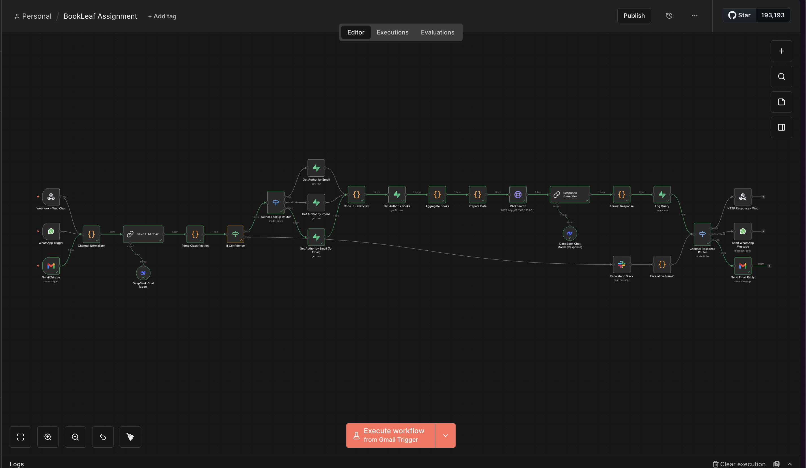
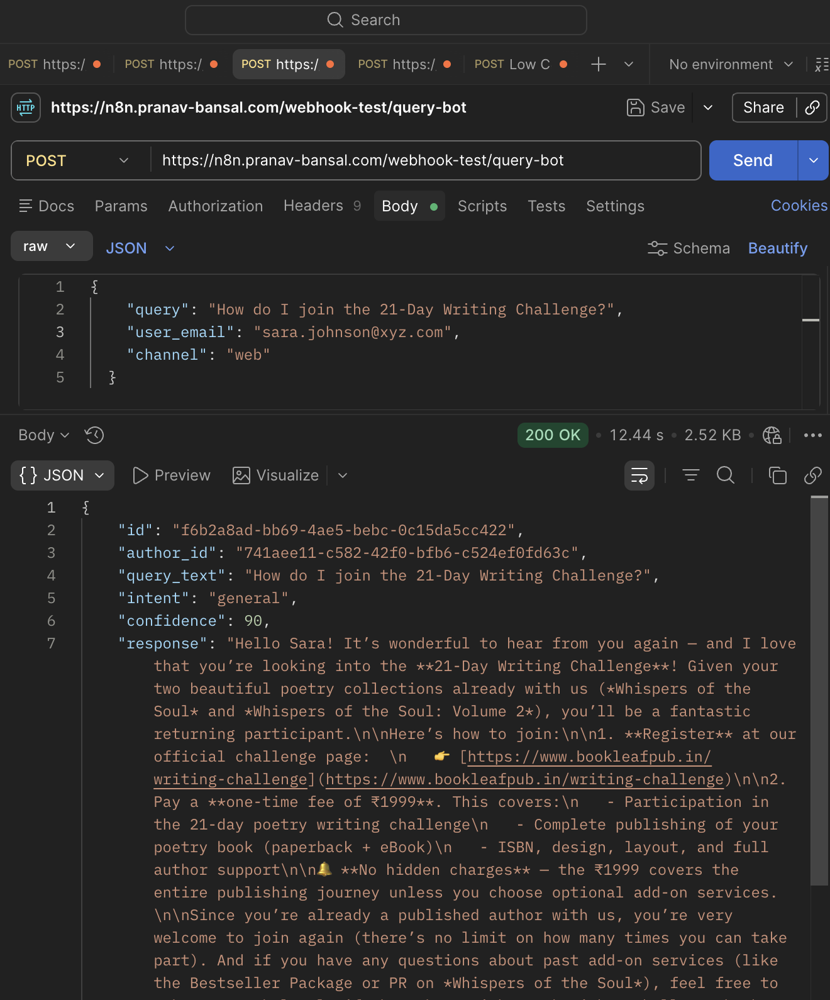
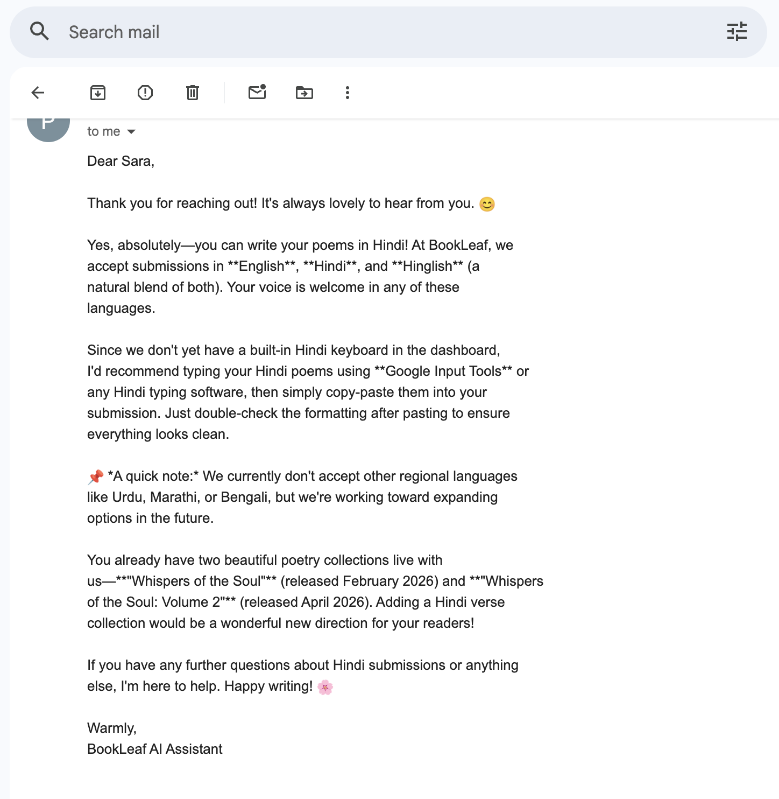
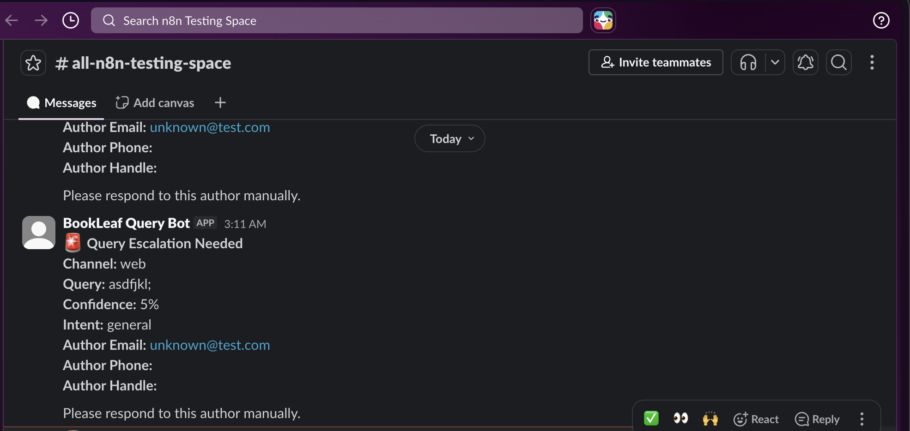
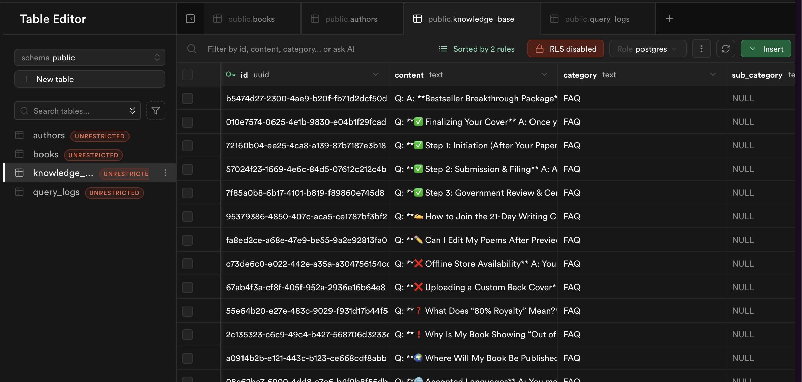
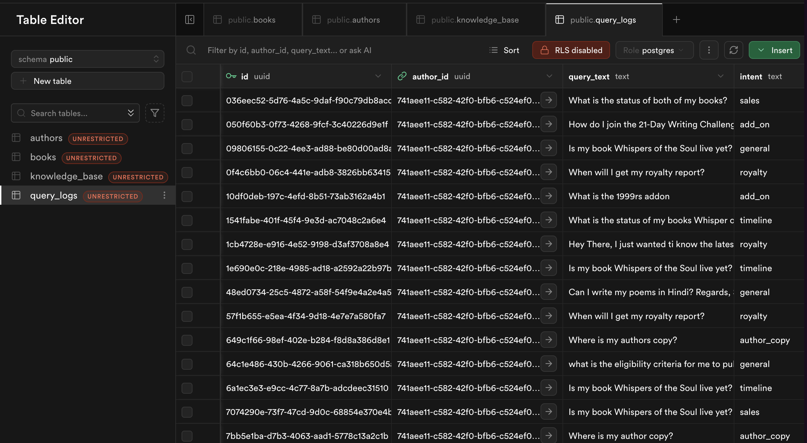

## 📋 Project Overview

This project delivers a **production-ready, multi-channel AI query responder bot** for BookLeaf Publishing, capable of handling queries across Email, WhatsApp, and Web Chat. The system intelligently routes queries, retrieves author/book data from Supabase, searches a knowledge base using RAG, and escalates low-confidence queries to human agents via Slack.

This repo also contains a Jupyter Notebook which walks through a exploration of how to acheive a User Identity Unification System.

---

## 📁 Project Structure

```
bookleaf-ai-automation/
│
├── BookLeaf Assignment.json              # Complete n8n workflow export
├── rag_service.py                        # FastAPI RAG microservice
├── requirements.txt                      # Python dependencies
├── FAQs (Knowledge Base) - AI Automation assignment.md  # Knowledge base file
├── User Identity Exploration.ipynb       # Jupyter notebook - identity unification
│
├── 📸 Screenshots/
│   ├── n8n-workflow.png                  # Full workflow canvas
│   ├── EXAMPLE-PostMan.png               # Webhook response demo
│   ├── EXAMPLE-Gmail.png                 # Email integration demo
│   ├── EXAMPLE-Slack.png                 # Slack escalation demo
│   ├── SupaBase1.png                     # Query logs in Supabase
│   └── SupaBase2.png                     # Authors & Books tables
│
└── README.md                             # This file
```

---

## 🎯 Key Features

### ✅ Customer Query Bot
- **Multi-channel ingestion**: Email, WhatsApp, WebHook
- **Natural language understanding**: DeepSeek LLM for intent classification
- **Structured data retrieval**: Supabase integration for author/book data
- **RAG-powered knowledge base**: Local embeddings for FAQ-style questions
- **Confidence-based escalation**: <80% confidence → human agent (Slack)
- **Full query logging**: Every query stored in Supabase
- **Multi-channel responses**: Reply via same channel (Web/WhatsApp/Email)

### ✅ Identity Unification System
- **Multi-strategy matching**: Exact, fuzzy, phonetic, semantic
- **Weighted confidence scoring**: 0-100% with explainable breakdown
- **Fallback mechanisms**: LLM as last resort for ambiguous cases
- **Jupyter notebook demo**: Interactive demonstration of all techniques

---

## 🛠️ Tech Stack

### Core Technologies
| Component | Technology | Purpose |
|-----------|------------|---------|
| **Workflow Orchestration** | n8n | Self-hosted, open-source workflow automation |
| **LLM for Classification** | DeepSeek | Cost-effective, fast query classification |
| **LLM for Response** | DeepSeek | Response generation with context |
| **Database** | Supabase (PostgreSQL) | Author/Book data + Query logs |
| **Vector Database** | Supabase + pgvector | RAG embeddings for knowledge base |
| **Embeddings** | Sentence Transformers (mxbai-embed-large-v1) | Local, 1024-dim embeddings (no OpenAI cost) |
| **RAG Service** | FastAPI | Python microservice for embeddings |
| **Fuzzy Matching** | rapidfuzz | Levenshtein, Token Sort Ratio |
| **Phonetic Matching** | Soundex | Custom implementation |
| **Frontend** | cURL / Postman | API testing |
| **Analytics** | Jupyter Notebook | Identity unification demonstration |

--- 

### Supabase Setup
```sql
-- Run this in Supabase SQL Editor
CREATE TABLE authors (
    id UUID PRIMARY KEY DEFAULT gen_random_uuid(),
    email TEXT UNIQUE,
    full_name TEXT,
    phone TEXT,
    instagram_handle TEXT,
    created_at TIMESTAMP DEFAULT NOW(),
    last_active TIMESTAMP DEFAULT NOW()
);

CREATE TABLE books (
    id UUID PRIMARY KEY DEFAULT gen_random_uuid(),
    author_id UUID REFERENCES authors(id),
    book_title TEXT NOT NULL,
    final_submission_date DATE,
    book_live_date DATE,
    royalty_status TEXT,
    royalty_amount DECIMAL,
    last_royalty_date DATE,
    isbn TEXT,
    add_on_services JSONB,
    sales_count INTEGER DEFAULT 0,
    author_copy_dispatched DATE,
    created_at TIMESTAMP DEFAULT NOW()
);

CREATE TABLE query_logs (
    id UUID PRIMARY KEY DEFAULT gen_random_uuid(),
    author_id UUID REFERENCES authors(id),
    query_text TEXT NOT NULL,
    intent TEXT,
    confidence FLOAT,
    response TEXT,
    escalated BOOLEAN DEFAULT FALSE,
    channel TEXT,
    created_at TIMESTAMP DEFAULT NOW()
);

CREATE TABLE knowledge_base (
    id UUID PRIMARY KEY DEFAULT gen_random_uuid(),
    content TEXT NOT NULL,
    embedding VECTOR(1024),
    category TEXT,
    metadata JSONB,
    created_at TIMESTAMP DEFAULT NOW()
);
```


### Start RAG Service
```bash
python rag_service.py
# Runs on http://localhost:8009
```

### Ingest Knowledge Base
```bash
curl -X POST http://localhost:8009/rag/ingest
```


## 🧪 Testing Examples

### Web Chat Testing
```bash
# Specific book query
curl -X POST http://localhost:5678/webhook/query-bot \
  -H "Content-Type: application/json" \
  -d '{"query":"Is my book Whispers of the Soul live yet?","user_email":"sara.johnson@xyz.com","channel":"web"}'

# Knowledge base query (RAG)
curl -X POST http://localhost:5678/webhook/query-bot \
  -H "Content-Type: application/json" \
  -d '{"query":"How do I join the 21-Day Writing Challenge?","user_email":"test@example.com","channel":"web"}'

# Low confidence (should escalate to Slack)
curl -X POST http://localhost:5678/webhook/query-bot \
  -H "Content-Type: application/json" \
  -d '{"query":"asdfjkl;","user_email":"unknown@test.com","channel":"web"}'
```

### WhatsApp Testing
Send a real WhatsApp message to your WhatsApp Business number. The bot will reply via WhatsApp.

### Email Testing
Send an email to the connected Gmail account. The bot will reply via email.

---

## 🔧 Configuration

### Environment Variables
```bash
# Supabase
SUPABASE_URL=your_supabase_url
SUPABASE_KEY=your_supabase_key
```

---

## 🧠 Identity Unification System

### Matching Techniques

| Technique | Description | When to Use |
|-----------|-------------|-------------|
| **Exact Matching** | After normalization, strings are identical | Email, Phone, Handles |
| **Levenshtein Distance** | Edit distance for typos | Short strings, usernames |
| **Soundex** | Phonetic encoding | Name variations |
| **Token Sort Ratio** | Word-order independent | Full names |
| **Email Matching** | Username + Domain analysis | Email addresses |
| **Phone Matching** | Normalized with suffix checks | Phone numbers |
| **Combined Scoring** | Weighted multi-technique | Final decision |

### Confidence Scoring

| Weight | Match Type | Points |
|--------|------------|--------|
| High | Exact Email | 40 |
| High | Exact Phone | 30 |
| Medium | Exact Handle | 20 |
| Medium | Fuzzy Name | 20 |
| Low | Fuzzy Email | 10 |
| Low | Phone Suffix | 5 |
| Very Low | Soundex | 5 |

### Why Not LLM as Primary?

| Factor | Traditional Methods | LLM |
|--------|-------------------|-----|
| **Cost** | Free | ~$0.005/match |
| **Speed** | < 10ms | 500-2000ms |
| **Explainability** | ✅ Traceable | ❌ Black box |
| **Determinism** | ✅ Consistent | ❌ Results vary |

**LLM is used as a fallback only for special ambiguous**

---

## 📸 Screenshots

### 1. n8n Workflow

*Complete multi-channel workflow with classification, lookup, RAG, and response routing.*

### 2. Postman Demo

*Webhook response showing book details with live date, ISBN, and status.*

### 3. Gmail Integration

*Email trigger processing author queries and sending replies.*

### 4. Slack Escalation

*Low-confidence queries automatically escalate to human agents.*

### 5. Supabase Logs

*All queries logged with intent, confidence, and response.*

### 6. Supabase Data

*Authors and Books tables with mocked data.*

---

## 🎥 Loom Video

**Video Link for n8n Worklflow:** : https://www.loom.com/share/3ecf1689768341c68679ab255b920d79

**Video Link for User Identity Exploration** : https://www.loom.com/share/28e5c3fa89bb42feac753bfefa28607e

---

## 🏆 Self-Rating


---

## 📞 Contact & Submission

**Submitted to:** `hr@bookleafpub.in`  
**CC:** `shivangiverma@bookleafpub.in`, `musavir@bookleafpub.in`

**GitHub Repository:** https://github.com/artzuros/bookleaf

---
